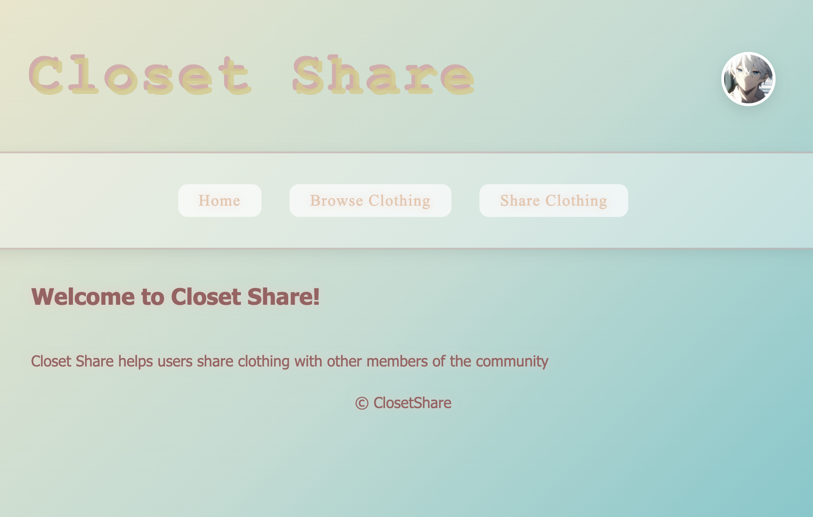

# ClosetShare

A full-stack campus clothing sharing platform that allows students to publish, borrow, search, and review clothing items.

Developed independently using Node.js, Express.js, MongoDB, and EJS.

---

## Project Overview

ClosetShare is a web application designed for university students to share, rent, and borrow clothing within campus.

The platform aims to reduce clothing waste while providing students with an easy way to access formal wear, seasonal clothing, and daily outfits.

Users can register, publish clothing, browse available items, submit borrowing requests, leave reviews, and manage their personal profiles.

---

## Tech Stack

### Frontend

- HTML5
- CSS3
- JavaScript (ES6)
- EJS

### Backend

- Node.js
- Express.js

### Database

- MongoDB
- Mongoose

### Authentication

- Express Session
- bcrypt
- Google OAuth

### Other Tools

- Git
- GitHub
- dotenv

---

## Main Features

### User System

✔ User Registration

✔ User Login

✔ Google Login

✔ User Logout

✔ Personal Profile

✔ Session Authentication

---

### Clothing Management

✔ Publish Clothing

✔ Browse Clothing

✔ Clothing Details

✔ Edit Clothing

✔ Delete Clothing

✔ Clothing Availability Status

---

### Search & Filter

✔ Keyword Search

✔ Category Filter

✔ Size Filter

✔ Color Filter

✔ Brand Filter

✔ Condition Filter

✔ Price Range Filter

✔ Sorting

- Latest
- Price (Low → High)
- Price (High → Low)

---

### Borrowing System

✔ Borrow Request

✔ Borrow Approval

✔ Borrow Rejection

✔ Borrow Status Management

---

### Rating & Review

✔ Five-Star Rating

✔ User Reviews

✔ Average Rating Display

✔ Review Count

---

### Recommendation System

Recommend similar clothing based on:

- Category
- Size
- Color
- Brand
- Rating
- Availability

---

### Security

✔ Password Encryption (bcrypt)

✔ Session Authentication

✔ Authorization Control

✔ Owner Permission Verification

✔ Input Validation

✔ Environment Variable Protection

✔ XSS Prevention

✔ Error Handling

---

## Database Design

### User

- Username
- Email
- Password (Encrypted)
- Avatar
- Bio
- Preferred Size
- Favorite Style

---

### Clothing Item

- Name
- Description
- Category
- Size
- Color
- Brand
- Condition
- Image
- Rental Price
- Availability
- Owner
- Created Time

---

### Borrow Request

- Applicant
- Clothing Item
- Owner
- Start Date
- End Date
- Message
- Status

---

### Review

- User
- Clothing Item
- Rating
- Comment
- Created Time

---

## Project Structure

```
ClosetShare
│
├── models
│
├── routes
│
│
├── middleware
│
├── views
│
│   ├── auth
│   ├── items
│   ├── users
│   └── partials
│
├── public
│
│   ├── css
│   ├── images
│   └── js
│
├── app.js
├── package.json
└── README.md
```

---

## Project Highlights

- Built a complete full-stack web application independently.
- Implemented CRUD operations using Express and MongoDB.
- Designed user authentication with encrypted passwords.
- Implemented role-based authorization to prevent unauthorized operations.
- Designed search, filtering, recommendation, and review systems.
- Applied RESTful API design principles.
- Developed responsive user interfaces using HTML, CSS, and JavaScript.

---

## Screenshots

### Home Page



---

### Clothing List


---

### Clothing Details


---

### Share Clothing


---

### User Profile


---

### Borrow Request


---

## Future Improvements

- Real-time chat
- Push notifications
- AI clothing recommendation
- Mobile responsive optimization
- Payment integration
- Image upload optimization

---

## My Contributions

This project was independently designed and developed.

Responsibilities include:

- UI Design
- Database Design
- Backend Development
- Frontend Development
- RESTful API
- Authentication System
- Search System
- Recommendation Algorithm
- Borrow Workflow
- Security Design
- Testing and Debugging
